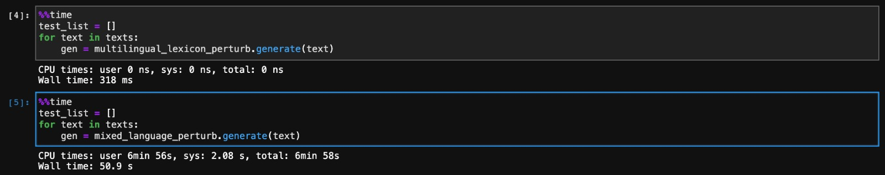

# Multilingual Lexicon Perturbation 🦎  + ⌨️ → 🐍
This perturbation translates words from any supported languages (e.g., English) to other supported languages (e.g., German) by using a multilingual lexicon. Thus, it can be used to test the robustness of a model in a multilingual setting. 

There are 100 language supported as listed below:
Afrikaans (af), Amharic (am), Arabic (ar), Asturian (ast), Azerbaijani (az), Bashkir (ba), Belarusian (be), Bulgarian (bg), Bengali (bn),
Breton (br), Bosnian (bs), Catalan; Valencian (ca), Cebuano (ceb), Czech (cs), Welsh (cy), Danish (da), German (de), Greeek (el), English (en),
Spanish (es), Estonian (et), Persian (fa), Fulah (ff), Finnish (fi), French (fr), Western Frisian (fy), Irish (ga), Gaelic; Scottish Gaelic (gd),
Galician (gl), Gujarati (gu), Hausa (ha), Hebrew (he), Hindi (hi), Croatian (hr), Haitian; Haitian Creole (ht), Hungarian (hu), Armenian (hy),
Indonesian (id), Igbo (ig), Iloko (ilo), Icelandic (is), Italian (it), Japanese (ja), Javanese (jv), Georgian (ka), Kazakh (kk), Central Khmer (km),
Kannada (kn), Korean (ko), Luxembourgish; Letzeburgesch (lb), Ganda (lg), Lingala (ln), Lao (lo), Lithuanian (lt), Latvian (lv), Malagasy (mg),
Macedonian (mk), Malayalam (ml), Mongolian (mn), Marathi (mr), Malay (ms), Burmese (my), Nepali (ne), Dutch; Flemish (nl), Norwegian (no),
Northern Sotho (ns), Occitan (post 1500) (oc), Oriya (or), Panjabi; Punjabi (pa), Polish (pl), Pushto; Pashto (ps), Portuguese (pt),
Romanian; Moldavian; Moldovan (ro), Russian (ru), Sindhi (sd), Sinhala; Sinhalese (si), Slovak (sk), Slovenian (sl), Somali (so), Albanian (sq),
Serbian (sr), Swati (ss), Sundanese (su), Swedish (sv), Swahili (sw), Tamil (ta), Thai (th), Tagalog (tl), Tswana (tn), Turkish (tr),
Ukrainian (uk), Urdu (ur), Uzbek (uz), Vietnamese (vi), Wolof (wo), Xhosa (xh), Yiddish (yi), Yoruba (yo), Chinese (zh), Zulu (zu)

The multilingual lexicon is generated by using the M2M100 model, Beyond English-Centric Multilingual Machine Translation (JMLR 2021). 

Processing speed of this Multilingual Lexicon Perturbation vs (Mixed Language Perturbation)[https://github.com/gentaiscool/NL-Augmenter/tree/mixed_language_perturbation/transformations/mixed_language_perturbation] is 6.24x faster on the lexicon based one. The comparison of both perturbation are shown below:
<h1 align="center">
  
</h1>

Author names:
- Genta Indra Winata (giwinata@connect.ust.hk, The Hong Kong University of Science and Technology),
- Samuel Cahyawijaya (scahyawijaya@connect.ust.hk, The Hong Kong University of Science and Technology)
- Bryan Wilie (bryanwilie92@gmail.com, Institut Teknologi Bandung).

## What type of a transformation is this?
This transformation acts as a perturbation to test robustness. Few words were picked at random with a probability and translated to the target language if the word is in the lexicon dctionary.

## Previous Work
(1) Mixed-Language Training (Published in AAAI 2020)
```bibtex
@inproceedings{liu2020attention,
  title={Attention-informed mixed-language training for zero-shot cross-lingual task-oriented dialogue systems},
  author={Liu, Zihan and Winata, Genta Indra and Lin, Zhaojiang and Xu, Peng and Fung, Pascale},
  booktitle={Proceedings of the AAAI Conference on Artificial Intelligence},
  volume={34},
  number={05},
  pages={8433--8440},
  year={2020}
}
```
(2) Continual Mixed-Language Pre-Training (Accepted in ACL Findings 2021)
```
@article{liu2021continual,
  title={Continual Mixed-Language Pre-Training for Extremely Low-Resource Neural Machine Translation},
  author={Liu, Zihan and Winata, Genta Indra and Fung, Pascale},
  journal={arXiv preprint arXiv:2105.03953},
  year={2021}
}
```
(3) M2M100 Model, Beyond English-Centric Multilingual Machine Translation (JMLR 2021)
```
@article{fan2021beyond,
  title={Beyond english-centric multilingual machine translation},
  author={Fan, Angela and Bhosale, Shruti and Schwenk, Holger and Ma, Zhiyi and El-Kishky, Ahmed and Goyal, Siddharth and Baines, Mandeep and Celebi, Onur and Wenzek, Guillaume and Chaudhary, Vishrav and others},
  journal={Journal of Machine Learning Research},
  volume={22},
  number={107},
  pages={1--48},
  year={2021}
}

```

## What are the limitations of this transformation?
The transformation only handles 3000 common English words listed on https://www.ef.com/wwen/english-resources/english-vocabulary/top-3000-words/.
